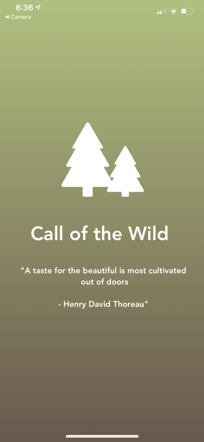
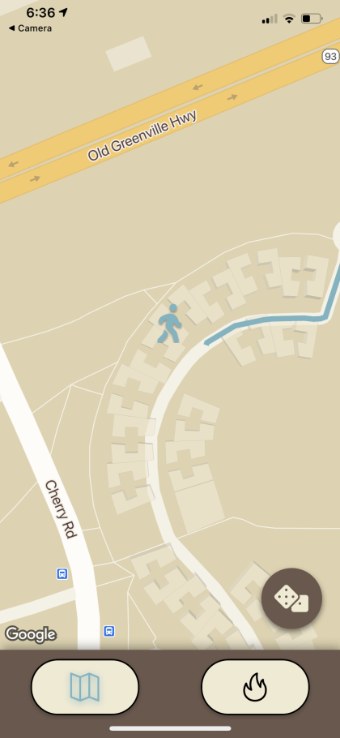
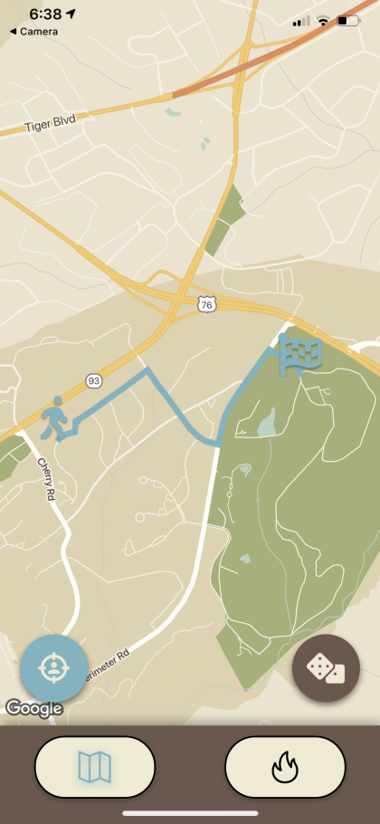
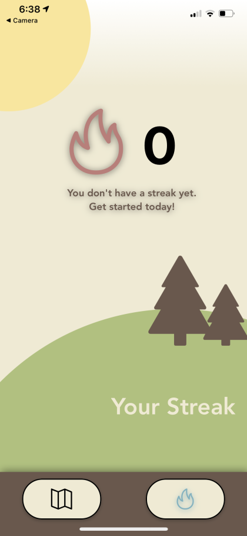

<p align="center">
    
</p>
<h1 align="center">
  Call of the Wild
</h1>

## About

This is the project we made for the 24 hour hackathon, [CUHackit 2021](https://cuhackit2021.devpost.com/). Created and designed by: [Giang Vu](https://github.com/GVU-GAME), [Stephen Russell](https://github.com/StphnRssll), and [Joshua Little](https://github.com/Mjtlittle). It received the award for Best UI/UX.

- [Devpost Link](https://devpost.com/software/call-of-nature)
- [Hackathon Link](https://cuhackit2021.devpost.com/)

### Inspiration
Over this past year, we have spent countless hours a day indoors without any outdoor activity. Recent [studies](https://www.tandfonline.com/doi/full/10.1080/00952990.2020.1832508) have shown that prolonged time indoors is connected to depression and binge drinking in young adults. It is at these times that an outside factor pushing us to move around is necessary. That's why we made this app to gamify the act and jumpstart outdoor interests.

### What it does
The app picks a random location in a radius around the user as a goal to walk to. After reaching the target the daily streak increases by one incentivizing daily activity. 

### How we built it
For this project, we used React Native for the frontend and Node.js for the backend. All of the graphics for the app were designed collaboratively beforehand in Figma. The backend was created with Express.js and talks to the Google Cloud API to generate a random location snapped to nearby roads along with directions to said location.

### Challenges we ran into
Throughout the process, we discovered and refined ideas that we had going into the hackathon. Many of which have changed and been removed as the project developed. We also ran into development environment problems prompting us to quickly adapt to stay on track with our morphing plan.

### Accomplishments that we're proud of
In the end, all of the significant functionality we anticipated at the beginning of the project is complete and implemented to our satisfaction. We have a backend that interacts with google cloud to generate a random location and the directions to said location. On the frontend side, we communicated with the backend server ultimately rendering a recommended walking path for the user. The interface is intuitive and easy to use.

### What we learned
None of us have ever worked in React-Native before, developing for the mobile platform. Coming from a purely React background, it was hard getting used to the differences that are so hard ingrained from web development. We also delved deeply into the backend side of mobile development, communicating with an authenticated 3rd party API.

### What's next for Call of the Wild
Some ideas beforehand were not implemented, like a monetary component or a data collection aspect for personal habits research. We would also like to deploy the app to the Google Play Store for everyone to use, hopefully, to make an impact on people currently unmotivated to leave the house. Whether that is only one person or the whole world.

_Random Locations. Walking. Daily Streaks. Healthy. Fun._

---

## Screenshots







---

## Development

To run the project yourself you will need the latest LTS version of [Node.js](https://nodejs.org/en/) installed. You will also need a mobile device with the **Expo Go** app installed (availible on Android and iOS). Then clone the repo and follow the below steps.

**The Backend**
1. get an API private key capable of communicating with Google's **Roads API** and **Directions API**, and store it in a file called `.env` in the `backend` directory like below:

    ```ini
    GOOGLE_MAPS_API_KEY=[private key goes here]
    ```
2. enter the `backend` directory
3. run `npm run start`, to start the backend server
4. now the server should be running allowing the frontend to communicate with it

**The Frontend**
1. enter the `frontend` directory
2. change the `backend_address` at the top of the `settings.json` file to an address that can be accessed by your phone (private ip if over LAN) corresponding to the backend server
3. run `npm install`, which will setup the project dependencies
4. then run `npm run start` to start the frontend server
5. scan the qr code in **Expo Go** (Android) or using the camera app (on iOS)
6. you should now see the app as intended :)


